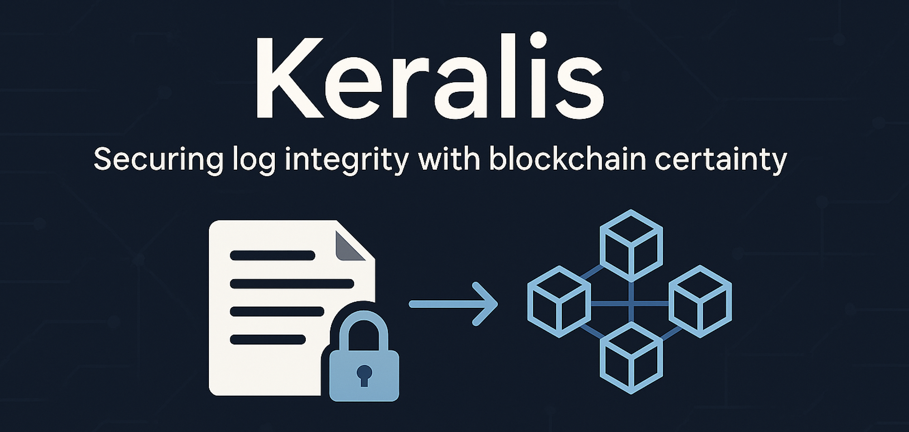
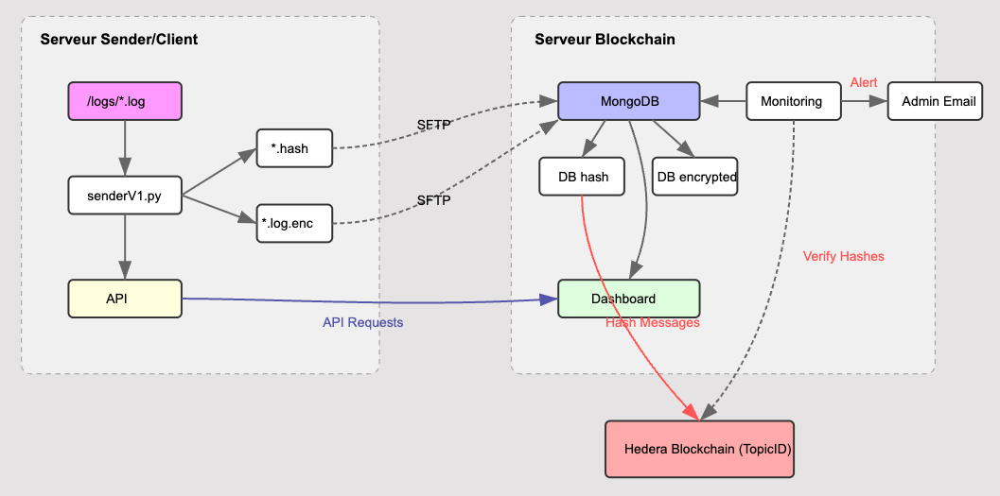
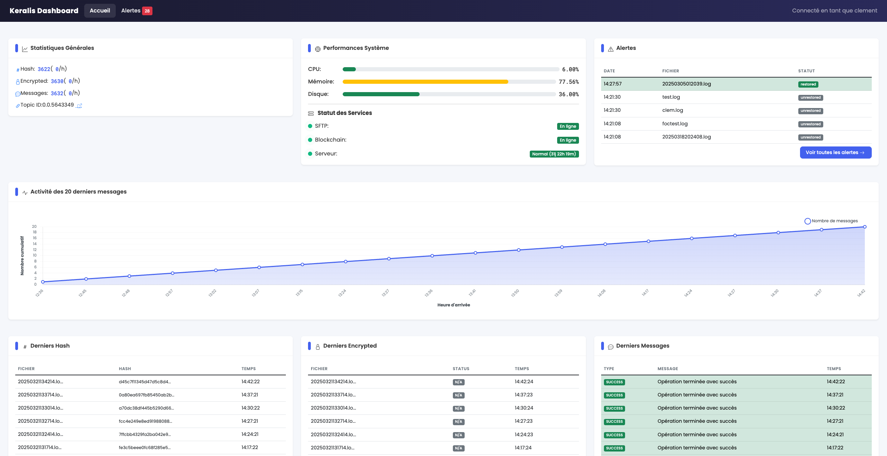

# Keralis

<div align="center">
  
  <p><i>Securing log integrity with blockchain certainty</i></p>
  
  [](https://opensource.org/licenses/MIT)
  [](https://www.hedera.com/)
  [](https://nodejs.org/)
  [](https://docs.keralis.org)
  [](https://dashboard.keralis.org)
</div>


## 🚀 Installation Rapide (Docker)

La façon la plus simple de déployer Keralis est d'utiliser nos images Docker officielles.

### Images Officielles
- **Serveur** : [`clemarz/keralis-server`](https://hub.docker.com/r/clemarz/keralis-server)
- **Client** : [`clemarz/keralis-sender`](https://hub.docker.com/r/clemarz/keralis-sender)

### 1. Déployer le Serveur (Backend)
Créez un fichier `docker-compose.yml` et lancez la stack :

```bash
# Télécharger le docker-compose.yml
curl -O https://raw.githubusercontent.com/clab60917/keralis/feature/docker-migration/docker-compose.yml

# Configurer vos clés Hedera
echo "HEDERA_ACCOUNT_ID=0.0.xxxx" >> .env
echo "HEDERA_PRIVATE_KEY=302e..." >> .env

# Lancer
docker compose up -d
```

### 2. Déployer le Client (Sender)
Sur la machine dont vous voulez surveiller les logs :

```bash
docker run -d \
  --name keralis-sender \
  --restart always \
  -v /var/log/nginx:/app/logs_mount \
  -e SFTP_HOST=ip_du_serveur \
  -e SFTP_PORT=2222 \
  -e SFTP_USERNAME=keralis \
  -e SFTP_PASSWORD=keralissecurepass \
  clemarz/keralis-sender:latest
```

---

## 📚 Documentation Détaillée
- [Guide de Déploiement Complet](DEPLOYMENT_GUIDE.md)
- [Guide de Publication Docker Hub](PUBLISHING.md)

---

## Overview

Keralis is a distributed security system that ensures log file integrity using Hedera blockchain technology. It detects unauthorized modifications to system logs in real-time, providing tamper-evident monitoring for critical infrastructure.

**Why it matters**: When attackers compromise systems, log tampering is often their first action to hide their tracks. Keralis ensures any log manipulation is immediately detected and reported, preserving the evidence needed for security investigations and compliance requirements.

## The Problem: Log Integrity at Risk

In today's cybersecurity landscape, log files represent critical elements for incident detection and forensic analysis. However, these files are primary targets during cyber attacks:

- **External attackers** modify logs to conceal intrusions and malicious activities
- **Insider threats** alter audit trails to hide unauthorized actions
- **Advanced attacks** frequently include log tampering to extend detection time
- **Traditional protection** methods often have exploitable weaknesses

Most security frameworks and compliance regulations (NIST, ISO27001, PCI-DSS) mandate log integrity protection, but implementing effective solutions remains challenging for many organizations.

## Key Features

| Feature | Description |
|---------|-------------|
| 🔐 **Blockchain Verification** | All log hashes are permanently recorded on Hedera's immutable ledger, creating a tamper-evident chain of evidence |
| ⚡ **Real-time Detection** | Instant identification of log file modifications or deletions through continuous integrity checking |
| 🔔 **Automated Alerts** | Detailed email notifications when integrity violations are detected, including original and modified hash information |
| 📊 **Monitoring Dashboard** | Comprehensive web interface for system status, historical alerts, and forensic analysis |
| 🛡️ **Distributed Architecture** | Strategic separation of components for enhanced security against sophisticated attacks |
| 🔍 **Public Verification** | Independent validation via Hashscan.io blockchain explorer using the TopicID |
| 💸 **Cost-Effective** | Under $40/month for a typical 5-server deployment including all blockchain transaction fees |
| 🔄 **Continuous Verification** | Periodic integrity checks comparing current file hashes with blockchain records |
| 🔒 **Encrypted Storage** | Secure transmission and storage of log files with strong encryption |
| 📈 **Scalable Design** | Proven architecture for handling from small deployments to enterprise-scale environments |

## System Architecture

Keralis operates using two main components working together in a distributed architecture designed to maximize security:

### 1. Sender/Client Server

The client-side component monitors your system's logs and prepares them for secure verification:

- **Automatic Detection**: Continuously monitors log directories for new files
- **Hash Generation**: Calculates cryptographic SHA-256 hashes for each log file
- **Encryption**: Creates encrypted copies of logs (.log.enc) for secure storage
- **Secure Transfer**: Transmits files to the blockchain server via SFTP
- **Verification API**: Exposes REST endpoints for integrity checking
- **Resource Efficient**: Minimal impact on host system performance

### 2. Blockchain Server

The security-focused component that handles verification and alerting:

- **Secure Reception**: Receives and validates files transmitted from client servers
- **Blockchain Anchoring**: Publishes log hashes to the Hedera Consensus Service (HCS)
- **MongoDB Storage**: Maintains databases of hashes, encrypted logs, and system events
- **Integrity Verification**: Periodically compares current log hashes with blockchain records
- **Alert Generation**: Creates and sends notifications when discrepancies are detected
- **Dashboard Interface**: Provides visual monitoring and analysis tools
- **Historical Records**: Maintains comprehensive audit trail of all system activity

<div align="center">
  
  <p><i>Secure data flow between system components</i></p>
</div>

## Real-World Performance

Keralis has been thoroughly tested in production environments to ensure reliability and efficiency:

- **Fast Processing**: Calculates SHA-256 hashes in milliseconds even for large log files
- **High Throughput**: Handles hundreds of log files per day with minimal latency
- **Low Resource Usage**: Operates efficiently on servers with just 1GB RAM
- **Predictable Costs**: Blockchain transaction fees remain consistent and affordable
- **Proven Reliability**: Maintains continuous monitoring with automatic recovery

### Performance Metrics

| Benchmark | Result |
|-----------|--------|
| Hash calculation time (100K line file) | 0.006 seconds |
| Average processing time per file | 6 seconds (detection to blockchain) |
| Daily processing capacity | 500+ files (5-server infrastructure) |
| System resource utilization | 70% capacity on 1GB RAM server |
| Blockchain transaction cost | $0.0001 per hash/message |

## Perfect For

- **Security Operations Centers (SOCs)** requiring tamper-evident log monitoring
- **Regulated industries** with compliance requirements (NIST, ISO27001, PCI-DSS, HIPAA)
- **Financial institutions** concerned about fraud and insider threats
- **Government agencies** needing verifiable security monitoring
- **Healthcare organizations** protecting sensitive patient data
- **IT departments** requiring forensic evidence for incident response
- **Managed Security Service Providers (MSSPs)** offering log integrity as a service

## Getting Started

### Prerequisites

- Node.js v18 or higher
- PM2 (global): `npm install -g pm2`
- MongoDB v5 or higher
- Hedera Testnet Account
- Two Linux servers (Ubuntu 20.04+ recommended)

### Quick Installation

```bash
# Clone the repository
git clone https://github.com/clab60917/keralis.git

# Install dependencies
cd keralis
npm install

# Configure environment
cp .env.example .env
nano .env

# Start services
pm2 start ecosystem.config.js
```

For detailed setup instructions including server preparation, configuration options, and testing procedures, please refer to our comprehensive documentation.

### Documentation & Resources

- **[Full Documentation](https://docs.keralis.org)** - Complete setup and configuration guide
- **[Live Dashboard Demo](https://dashboard.keralis.org)** - See Keralis in action (username: demo, password: demo123)
- **[GitHub Repository](https://github.com/clab60917/keralis)** - Latest code and updates

## Technical Specifications

- **Blockchain Platform**: Hedera Consensus Service (HCS)
- **Backend Technologies**: Node.js v18+, Python
- **Database**: MongoDB v5+
- **Process Management**: PM2
- **Encryption**: AES-256 for file encryption
- **Hash Algorithm**: SHA-256
- **API Security**: API key authentication
- **Dashboard Security**: Username/password authentication
- **System Requirements**: Minimal (runs on 1GB RAM)
- **Scalability**: Tested with 100,000+ log lines and 500+ daily files
- **Monitoring**: Real-time dashboard with email alerting

## Dashboard Features

The Keralis monitoring dashboard provides comprehensive visibility into your log integrity status:

- **System Overview**: At-a-glance status of all monitored components
- **Alert Management**: List of all integrity violations with detailed information
- **Forensic Analysis**: Comparison tools for examining modified files
- **Blockchain Verification**: Direct links to Hashscan.io for independent validation
- **Performance Metrics**: System statistics and operational data
- **User Management**: Secure access control for administrative users

<div align="center">
  
  <p><i>Keralis monitoring dashboard interface</i></p>
</div>

## Security Best Practices

We recommend following these security practices when deploying Keralis:

- Regularly rotate API keys (every 90 days)
- Use strong passwords for dashboard access (12+ characters)
- Keep all system components updated
- Configure proper firewall rules for both servers
- Enable HTTPS for all web interfaces
- Perform regular security audits
- Monitor access logs for suspicious activity

## Development Roadmap

Future development plans for Keralis include:

1. Multi-client administration interface for managed service providers
2. Enhanced hash calculation optimization for extremely high-volume environments
3. CLI tool for automated deployment on various Linux distributions
4. Advanced analytics for threat intelligence
5. Integration with SIEM systems for unified security monitoring

## Contributing

We welcome contributions to the Keralis project! Here's how you can help:

- **Report issues**: Open detailed bug reports on GitHub
- **Suggest features**: Share your ideas for improvements
- **Submit code**: Contribute pull requests to enhance functionality
- **Improve documentation**: Help us make our guides more comprehensive
- **Share experiences**: Let us know how you're using Keralis

Please refer to our [contributing guidelines](https://github.com/clab60917/keralis/blob/main/CONTRIBUTING.md) for more details.

## Support

For questions, issues, or assistance:

- Open an [issue on GitHub](https://github.com/clab60917/keralis/issues)
- Check the [documentation](https://docs.keralis.org) for guides and troubleshooting
- Contact the development team through the repository

## License

This project is licensed under the MIT License - see the [LICENSE](https://github.com/clab60917/keralis/blob/main/LICENSE) file for details.

---

<div align="center">
  <p>⭐ If you find Keralis useful for your organization's security needs, please consider giving it a star! ⭐</p>
  <a href="https://github.com/clab60917/keralis">
    
  </a>
  <p><i>Keralis: When log integrity is non-negotiable.</i></p>
</div>